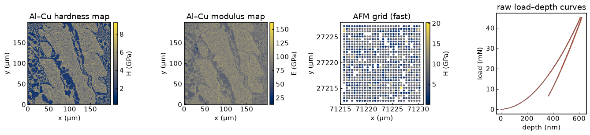
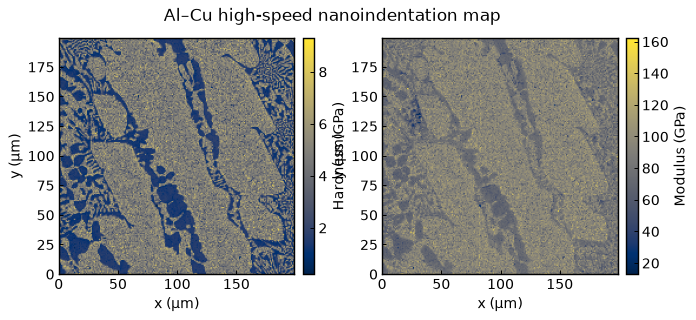
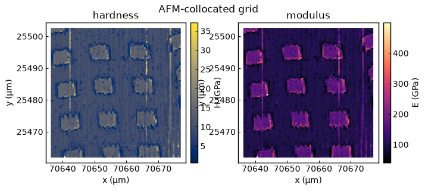
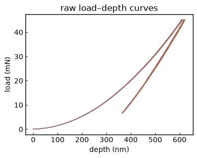
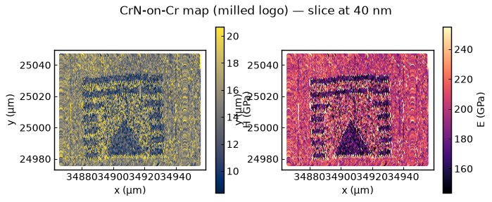
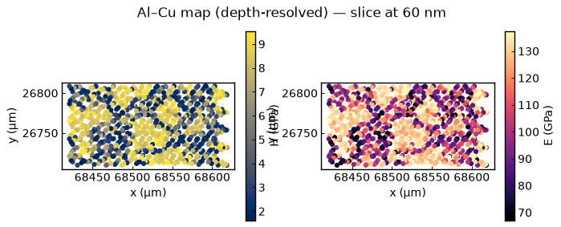
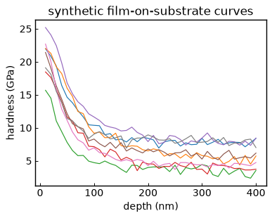
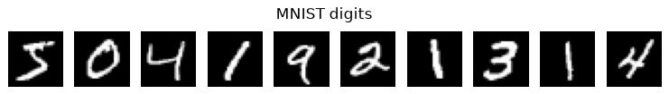

# The datasets

Everything the tutorial uses is **openly licensed and free to share**, and ships inside
the repo's `data/` folder — no downloads, no logins. Load it all through one helper:
`import mecanano_ml as mm`.


*From left: the Al–Cu hardness map, the same area's modulus map, the small AFM grid,
and a few raw load–depth curves.*

## High-speed nanoindentation maps — `data/nanoindent_maps/`
Al–Cu eutectic and duplex-steel maps (plus a titanium map): hardness `H`, modulus
`E` and their ratio `H/E` for **tens of thousands** of indents on a regular grid.

```python
df = mm.load_map("alcu_2um")     # a tidy table, one row per indent
mm.list_maps()                   # every map name you can load
```
Names include `alcu_1um/2um/3um/5um`, `duplex_1um/2um/5um`, `titanium`.


*The Al–Cu map: hardness (left) and modulus (right). The two phases are already visible.*

> **Licence — CC BY 4.0.** Please cite:
> H. Besharatloo & J. M. Wheeler, *Influence of indentation size and spacing on
> statistical phase analysis via high-speed nanoindentation mapping of metal alloys*,
> **J. Mater. Res. 36**, 2198–2212 (2021). https://doi.org/10.1557/s43578-021-00214-5

## AFM-collocated grid — `data/afm_grid.npz`
A small (~800-indent) grid that carries per-indent scalars **and** the full
depth-resolved curves — fast enough for the deep-learning notebooks.

```python
afm = mm.load_afm_grid()         # dict of arrays
afm.keys()                       # H, E, HE, X, Y, H_curve, load_mN, depth_nm, ...
```

*The AFM grid's hardness and modulus maps (one point per indent).*

*Author's own measurement, shared for teaching.*

## Raw load–depth curves — `data/nanoindentation_curves/`
Individual indentation curves used by the pop-in and curve-fitting notebooks.

```python
curves = mm.load_curves(6)       # list of (depth_nm, load_mN) pairs
```

*A few raw load–depth curves — the whole-curve input for the deep-learning notebooks.*

*Author's own measurements, shared for teaching (CC BY 4.0).*

## High-speed nanoindentation maps (depth-resolved) — `data/hsnm_maps/`
High-speed nanoindentation maps that keep the full hardness/modulus-vs-depth response at
every point, as open long-format CSVs (`indent, x_um, y_um, depth_nm, H_GPa, E_GPa`) — the
input to the **coating/substrate deconvolution** in notebook 07. Author's own measurements (CC BY 4.0).

```python
d = mm.load_hsnm_map("crn_cr_bilayer")   # CrN-on-Cr bilayer coating (~1160 indents)
d = mm.load_hsnm_map("alcu_eutectic")    # Al–Cu eutectic map (~120 indents)
# -> dict with depth_nm, H, E (n_indents × n_depth), X, Y
```

*The CrN-on-Cr map at a single depth slice — hardness (left) and modulus (right). The
milled logo shows as the softer/less-stiff lattice cutting through the intact coating.*


*The depth-resolved Al–Cu map at a single depth slice — hardness and modulus.*

## Synthetic data — `data/synthetic/`
`bilayer_synthetic.csv` — simulated film-on-substrate curves with **known** film/substrate
values (`Hf_true_GPa`, `Hs_true_GPa`), for validating deconvolution against ground truth.
Pure simulation (CC0).


*Simulated hardness-vs-depth curves: high near the surface (film), dropping toward the substrate.*

## MNIST — `data/MNIST/`
The classic handwritten-digit set (LeCun et al.), used **only** for the CNN warm-up
(notebook 10). Read directly from the raw files in the notebook.


*A few MNIST digits — the CNN warm-up before applying the idea to indentation curves.*

---

See `data/README.md` in the repo for the full provenance and licences.
